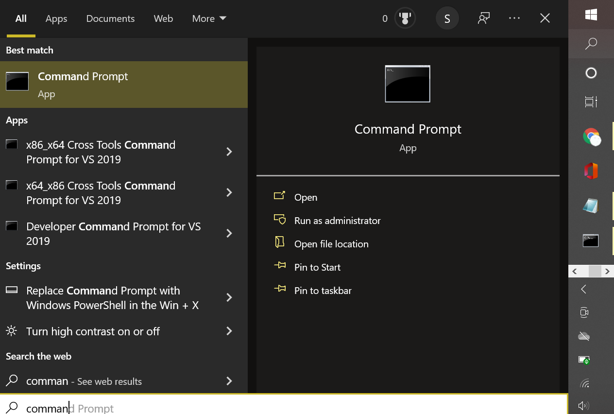
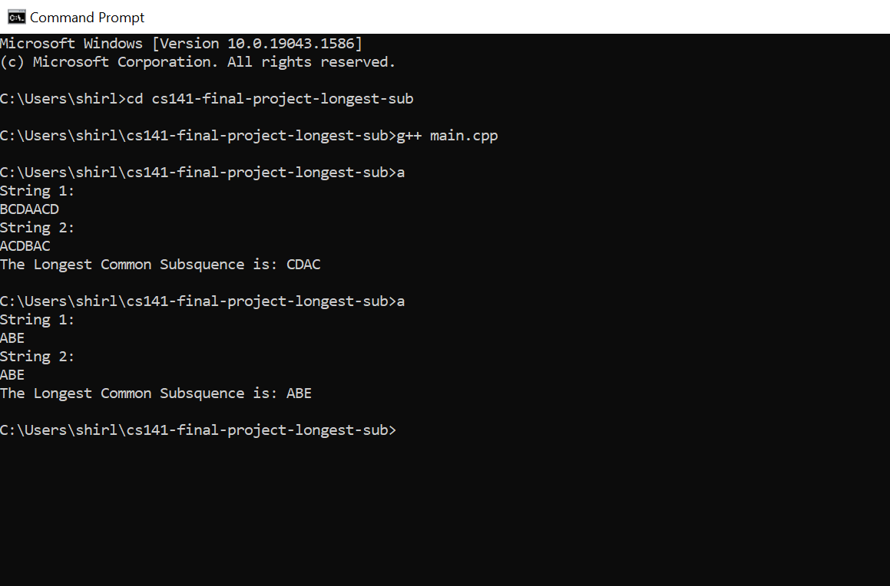

# CS141 Final Project: Longest Common Subsequence
> Author: Shirley Nguyen ([@shirleyzero4](https://github.com/shirleyzero4))

Given two string subsequences, the program returns a string that contains the two longest common subsequence between the two inputs.

# How to Compile and Run the Code
Using Windows, go to Command Prompt (can be found by searching through apps).



In the terminal, make a clone of the GitHub file using the command: 
```sh
$ git clone https://github.com/shirleyzero4/cs141-final-project-longest-sub.git
```

Go inside the file with the command:
```sh
$ cd cs141-final-project-longest-sub
```

Generate the executable file for the code:
```sh
$ g++ main.cpp
```

Run the executable:
```sh
$ a
``` 
  
# Running the Code
The code will ask for two string inputs and the program will find the longest common subsequence between the two strings.


